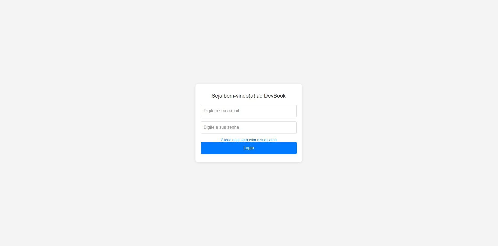
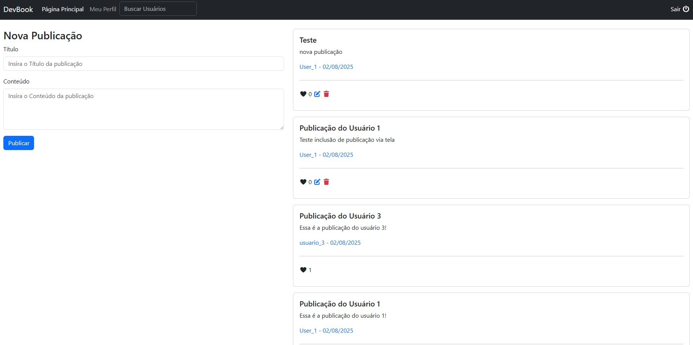
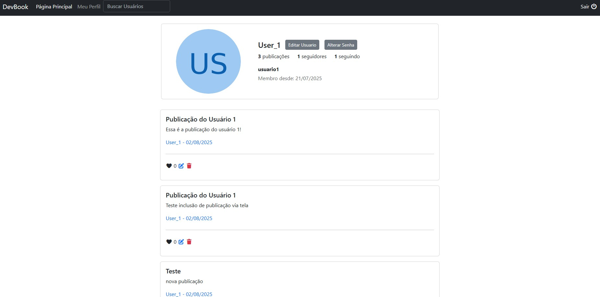

# 📘 DevBook

O **DevBook** é o projeto final do curso [Aprenda Golang do Zero! Desenvolva uma aplicação completa!](https://www.udemy.com/course/aprenda-golang-do-zero-desenvolva-uma-aplicacao-completa/).  
Trata-se de uma rede social simples para desenvolvedores, construída em **Go** com foco em consolidar conceitos aprendidos ao longo do curso.  

A ideia principal foi aplicar de forma prática os fundamentos de **Golang**, trabalhando com rotas, autenticação, banco de dados, templates, e boas práticas de desenvolvimento web.  

---

## 🚀 Tecnologias Utilizadas
- **Go (Golang)** – backend
- **Bootstrap** – estilização da aplicação
- **MySQL** – banco de dados
- **HTML + CSS + JavaScript** – frontend
- **net/http** – servidor web nativo do Go

---

## ⚙️ Funcionalidades
- Cadastro e login de usuários
- Seguir e deixar de seguir outros usuários
- Criar, editar e excluir publicações
- Curtir publicações
- Visualizar perfil próprio e de outros usuários

---

## 📸 Screenshots

Você pode incluir imagens da aplicação na pasta `docs/screenshots` (ou `assets/screenshots`) e depois referenciá-las aqui no README.  
Exemplo:

### Página de Login

### Timeline

### Perfil de Usuário

